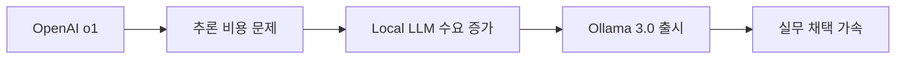

# AI News Curator → Insight Engine 업그레이드 계획

## 현재 시스템의 한계점
1. **표면적 정보 수집**: RSS 피드 기반 단순 뉴스 수집
2. **깊이 부족**: 원문 분석이나 컨텍스트 연결 없음
3. **단방향 큐레이션**: 정보 간 연결점을 찾지 못함
4. **제한된 소스**: 주로 테크 뉴스 사이트 위주

## 발전 방향: 3단계 진화

### 🎯 Phase 1: 고품질 소스 확장 (1-2주)
**새로운 소스 추가:**

#### 1. Podcast Transcripts
```python
# src/collectors/podcast_collector.py
podcast_sources = {
    'tech': [
        'Lex Fridman Podcast',     # AI/Deep Tech 인터뷰
        'All-In Podcast',           # 테크/비즈니스 인사이트
        'The Changelog',            # 개발자 인터뷰
        'Latent Space',            # AI 엔지니어링
        'Gradient Dissent',        # ML 연구
        'TWIML AI',                # This Week in ML
    ],
    'research': [
        'The Robot Brains',        # AI 연구자 인터뷰
        'Eye on AI',               # AI 트렌드
        'Practical AI',            # 실무 AI
    ]
}
```

#### 2. High-Quality Free Sources
```python
# src/collectors/free_insight_collector.py
free_sources = {
    'substack': [
        'The Pragmatic Engineer',
        'ByteByteGo',
        'TheSequence',
        'AI Supremacy'
    ],
    'tech_blogs': [
        'Simon Willison Blog',
        'Lilian Weng Blog',
        'Jay Alammar Blog',
        'Chip Huyen Blog'
    ],
    'communities': [
        'Hacker News Best',
        'Reddit r/LocalLLaMA',
        'GitHub Discussions'
    ]
}
```

#### 3. Primary Sources
```python
# src/collectors/primary_source_collector.py
primary_sources = {
    'papers': [
        'arxiv.org',           # 이미 있음, 개선 필요
        'openreview.net',      # 피어리뷰 논문
        'distill.pub',         # 시각화된 ML 연구
    ],
    'code': [
        'github.com/trending', # 트렌딩 레포
        'github.com/topics',   # 주제별 핫 프로젝트
    ],
    'forums': [
        'news.ycombinator.com/best',  # HN Best
        'reddit.com/r/LocalLLaMA',    # 실무 LLM
        'reddit.com/r/singularity',   # AGI 논의
    ]
}
```

### 🔗 Phase 2: 인사이트 연결 시스템 (2-3주)

#### 1. Cross-Reference Engine
```python
# src/insights/connection_engine.py
class InsightConnector:
    def find_connections(self, items):
        """
        아이템 간 연결점 찾기:
        - 같은 기술 스택 언급
        - 상반된 의견/관점
        - 시간적 진화 (v1 → v2)
        - 인과관계 (A때문에 B 발생)
        """

    def generate_insight(self, connected_items):
        """
        연결된 정보에서 인사이트 도출:
        - 트렌드 패턴 인식
        - 컨센서스 vs 논란
        - 숨겨진 기회 발견
        """
```

#### 2. Deep Content Analysis
```python
# src/insights/deep_analyzer.py
class DeepAnalyzer:
    def analyze_podcast(self, transcript):
        """
        팟캐스트 핵심 추출:
        - 주요 논점
        - 인용된 연구/프로젝트
        - 예측/전망
        - 실무 팁
        """

    def analyze_thread(self, tweets):
        """
        트위터 스레드 분석:
        - 핵심 주장
        - 뒷받침 근거
        - 반응/논쟁점
        """
```

### 💎 Phase 3: 지능형 큐레이션 (3-4주)

#### 1. Multi-Dimensional Scoring
```python
# src/insights/smart_scorer.py
scoring_dimensions = {
    'novelty': '얼마나 새로운 정보인가',
    'depth': '얼마나 깊이 있는 분석인가',
    'practical': '즉시 적용 가능한가',
    'controversy': '논란/토론 가치가 있는가',
    'trend_signal': '미래 트렌드 신호인가'
}
```

#### 2. Personalized Learning
```python
# src/insights/personalization.py
class PersonalLearning:
    def track_engagement(self, item, action):
        """사용자가 클릭/읽은 항목 추적"""

    def adjust_weights(self):
        """선호도에 따라 가중치 조정"""

    def predict_interest(self, new_item):
        """새 항목의 관심도 예측"""
```

## 구현 로드맵

### Step 1: 기본 인프라 확장 (이번 주)
```python
# src/collectors/enhanced_collector.py
class EnhancedCollector:
    def __init__(self):
        self.collectors = {
            'rss': RSSCollector(),          # 기존
            'arxiv': ArxivCollector(),      # 기존
            'youtube': YouTubeCollector(),  # 기존
            'podcast': PodcastCollector(),  # 신규
            'twitter': TwitterCollector(),  # 신규
            'github': GitHubCollector(),    # 신규
        }

    def collect_all(self):
        # 병렬로 모든 소스 수집
        results = {}
        with ThreadPoolExecutor(max_workers=10) as executor:
            futures = {
                executor.submit(c.collect): name
                for name, c in self.collectors.items()
            }
        return results
```

### Step 2: YouTube/Podcast Transcript 처리
```python
# src/processors/transcript_processor.py
class TranscriptProcessor:
    def extract_insights(self, transcript):
        prompt = """
        이 transcript에서:
        1. 핵심 아이디어 3개
        2. 실행 가능한 조언
        3. 언급된 도구/프로젝트
        4. 미래 예측/전망
        를 추출하세요.
        """
        return self.llm.extract(prompt, transcript)
```

### Step 3: 연결 그래프 구축
```python
# src/insights/knowledge_graph.py
class KnowledgeGraph:
    def __init__(self):
        self.graph = nx.DiGraph()

    def add_item(self, item):
        # 노드 추가
        self.graph.add_node(item.id, **item.attributes)

    def find_connections(self, item):
        # 유사도 기반 엣지 생성
        for node in self.graph.nodes():
            similarity = self.calculate_similarity(item, node)
            if similarity > 0.7:
                self.graph.add_edge(item.id, node, weight=similarity)

    def get_insights(self):
        # 그래프 분석으로 인사이트 도출
        clusters = nx.community.detect(self.graph)
        trends = self.identify_trends(clusters)
        return trends
```

### Step 4: 향상된 출력 포맷
```markdown
# AI Insights Digest - 2025-09-15

## 🎯 Today's Key Insight
**"LLM의 추론 능력이 Chain-of-Thought를 넘어서고 있다"**
- Karpathy의 트윗 + Anthropic 논문 + Cursor 업데이트가 모두 같은 방향 지시
- 실무 적용: CoT 대신 Tree-of-Thoughts 시도해볼 시기

## 🔥 Hot Debates
### 1. "AI Agents는 과대평가되었나?"
- **찬성**: Gary Marcus 트윗 스레드 [링크]
- **반대**: Simon Willison의 실제 구현 사례 [링크]
- **중립**: Lex Fridman 팟캐스트 with Yann LeCun [타임스탬프]

## 💡 Actionable This Week
1. **Cursor의 새 Composer 기능** - 멀티파일 편집이 게임체인저
2. **LangChain 2.0 마이그레이션** - 주말에 시도해볼 만함
3. **Claude Projects** - RAG 없이도 컨텍스트 관리 가능

## 🔮 Emerging Patterns
- **트렌드**: On-device AI가 빠르게 실용화 (Phi-3, Gemma)
- **신호**: 대형 테크 기업들이 모두 에이전트 플랫폼 준비 중
- **기회**: 한국어 특화 모델의 틈새시장 열림

## 📚 Deep Dives
- [45분] All-In Podcast: "왜 모든 SaaS가 AI로 재편되는가"
- [논문] "Mamba vs Transformer: 실무자 가이드"
- [코드] LangGraph로 만든 리서치 에이전트 구현

## 🔗 Connected Insights

```

## 즉시 실행 가능한 개선

### 오늘 당장 할 수 있는 것:
1. **무료 인사이트 수집기 활용** - Substack, HN, Reddit RSS 통합
2. **Podcast RSS 통합** - 이미 있는 RSS 수집기 활용
3. **Deep Summary 추가** - GPT-4로 더 깊은 분석

### 이번 주 목표:
1. YouTube Transcript API 연동
2. 정보 간 유사도 계산 로직
3. Notion 출력에 연결 그래프 추가

이 프로젝트를 점진적으로 진화시키면, 단순 뉴스 큐레이션을 넘어 진짜 인사이트를 제공하는 "Second Brain"이 될 수 있을 것 같습니다.